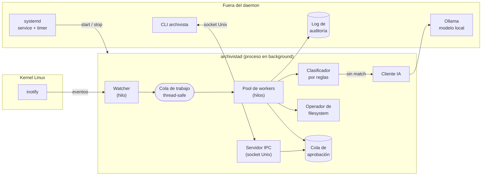

# Archivista

**Sistema Inteligente de Automatización con IA y Sistemas Operativos**
Trabajo Práctico Final — Sistemas Operativos (TM, Pilar) — USAL 2025

---

## Qué es

Archivista es un **daemon de Linux** que observa carpetas del sistema de archivos, detecta
archivos nuevos o modificados mediante **eventos del kernel (inotify)**, los clasifica usando
un **modelo de IA que corre localmente** (sin enviar datos a servicios externos) y los
reorganiza automáticamente en una estructura de carpetas coherente.

El comportamiento se adapta al **perfil de usuario** configurado:

| Perfil | Comportamiento |
|---|---|
| 🎓 Estudiante | Ordena apuntes y materiales, y **genera resúmenes** automáticos del contenido |
| 👨‍🏫 Profesor | Organiza **material de clase** por asignatura/unidad y genera índices del material |

Ejemplo del flujo real:

```
1. El usuario descarga  ~/Downloads/parcial-sistemas-operativos.pdf
2. inotify dispara un evento IN_CLOSE_WRITE
3. El daemon espera a que el archivo esté estable y lo encola
4. Un worker extrae texto y metadatos del PDF
5. El modelo local decide:  categoría = Documentos/Facultad/Sistemas Operativos
6. El archivo se mueve de forma atómica preservando permisos
7. (perfil Estudiante) se genera  ~/Documentos/.../parcial-sistemas-operativos.resumen.md
8. Todo queda registrado en el log de auditoría
```

> **Los borrados nunca son automáticos.** Cualquier operación destructiva entra en una cola
> de aprobación y requiere confirmación explícita del usuario vía CLI. Ver
> [ADR-0005](docs/adr/0005-borrado-con-aprobacion-humana.md).

---

## Estado del proyecto

🚧 **En desarrollo.** El trabajo está dividido en milestones e issues públicos:
👉 [Issues](https://github.com/Lucacux/files-clasifier-agentic-ai-usal/issues) · [Milestones](https://github.com/Lucacux/files-clasifier-agentic-ai-usal/milestones)

Ver el plan completo en [`docs/07-roadmap.md`](docs/07-roadmap.md).

---

## Documentación

Toda la documentación está en [`docs/`](docs/) y está pensada para poder leerse **sin
acceso al servidor**:

| Documento | Contenido |
|---|---|
| [00 — Consigna](docs/00-consigna.md) | Consigna original de la cátedra |
| [01 — Arquitectura](docs/01-arquitectura.md) | Componentes, diagramas y flujo de datos |
| [02 — Conceptos de SO](docs/02-conceptos-so.md) | Qué concepto de Sistemas Operativos usa cada parte |
| [03 — Entorno y servidor](docs/03-entorno-servidor.md) | Cómo se levanta el servidor Debian, hardware y plan B en cloud |
| [04 — Flujo de trabajo](CONTRIBUTING.md) | Git flow, convenciones de commits, revisión de código |
| [05 — Acceso del profesor](docs/05-acceso-profesor.md) | Usuario, credenciales y demo para la cátedra |
| [06 — Equipo y roles](docs/06-equipo-y-roles.md) | Quién hace qué |
| [07 — Roadmap](docs/07-roadmap.md) | Milestones y planificación |
| [08 — Mapeo de requisitos](docs/08-mapeo-requisitos.md) | Trazabilidad consigna ↔ implementación |
| [09 — Guía de Claude Code](docs/09-guia-claude-code.md) | Cómo usamos asistentes de IA para desarrollar, y con qué controles |
| [ADRs](docs/adr/) | Decisiones de arquitectura y su justificación |

---

## Arquitectura en una imagen



Detalle completo en [`docs/01-arquitectura.md`](docs/01-arquitectura.md).

---

## Stack

| Capa | Elección | Por qué |
|---|---|---|
| SO destino | Debian 12 minimal (headless) | [ADR-0003](docs/adr/0003-infraestructura-servidor.md) |
| Lenguaje | Python 3.11 | [ADR-0002](docs/adr/0002-python-y-watchdog.md) |
| Eventos FS | `inotify` vía `watchdog` | [ADR-0002](docs/adr/0002-python-y-watchdog.md) |
| IA | Modelo local vía **Ollama** | [ADR-0001](docs/adr/0001-ia-local-con-ollama.md) |
| IPC | Socket de dominio Unix | [ADR-0004](docs/adr/0004-ipc-socket-unix.md) |
| Servicio | `systemd` unit + timer | [ADR-0003](docs/adr/0003-infraestructura-servidor.md) |
| Configuración | YAML + variables de entorno | — |

---

## Inicio rápido (desarrollo local)

> Requiere Linux, Python 3.11+ y [Ollama](https://ollama.com) instalado.

```bash
git clone https://github.com/Lucacux/files-clasifier-agentic-ai-usal.git
cd files-clasifier-agentic-ai-usal

python3 -m venv .venv && source .venv/bin/activate
pip install -e ".[dev]"

cp config/archivista.example.yaml config/archivista.yaml
$EDITOR config/archivista.yaml          # ajustá carpetas y perfil

archivista --config config/archivista.yaml run --foreground
```

La instalación como servicio en el servidor está documentada en
[`docs/03-entorno-servidor.md`](docs/03-entorno-servidor.md).

---

## Para la cátedra

Hay un usuario dedicado (`profesor`) en el servidor con acceso de solo lectura a los logs,
la configuración y una **demo reproducible** que muestra el sistema completo en marcha.
Instrucciones en [`docs/05-acceso-profesor.md`](docs/05-acceso-profesor.md).

---

## Equipo

| Integrante | Área |
|---|---|
| Luca Lombardo | Infraestructura, sistema operativo, seguridad de rutas · *Project Manager* |
| Agustín Gil | Watcher inotify, concurrencia y operaciones de filesystem |
| Emma Tamborini | Capa de IA: modelo local, prompts, extracción de contenido |
| Zahira Dellosa | Perfiles de usuario, configuración y generación de contenido |
| Ginés Casajona | Daemon, IPC y CLI de control |
| Santiago Arriaga | Observabilidad, CI/CD, testing y documentación de entrega |

Detalle en [`docs/06-equipo-y-roles.md`](docs/06-equipo-y-roles.md).

---

## Licencia

[MIT](LICENSE)
