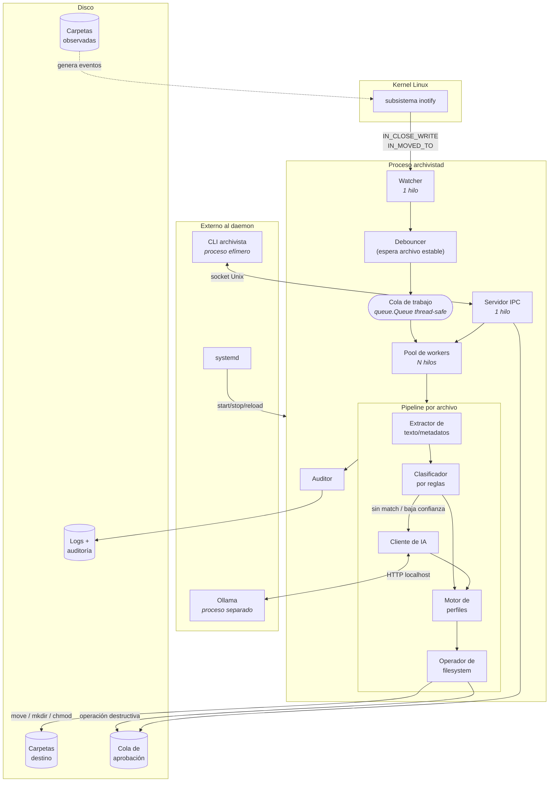
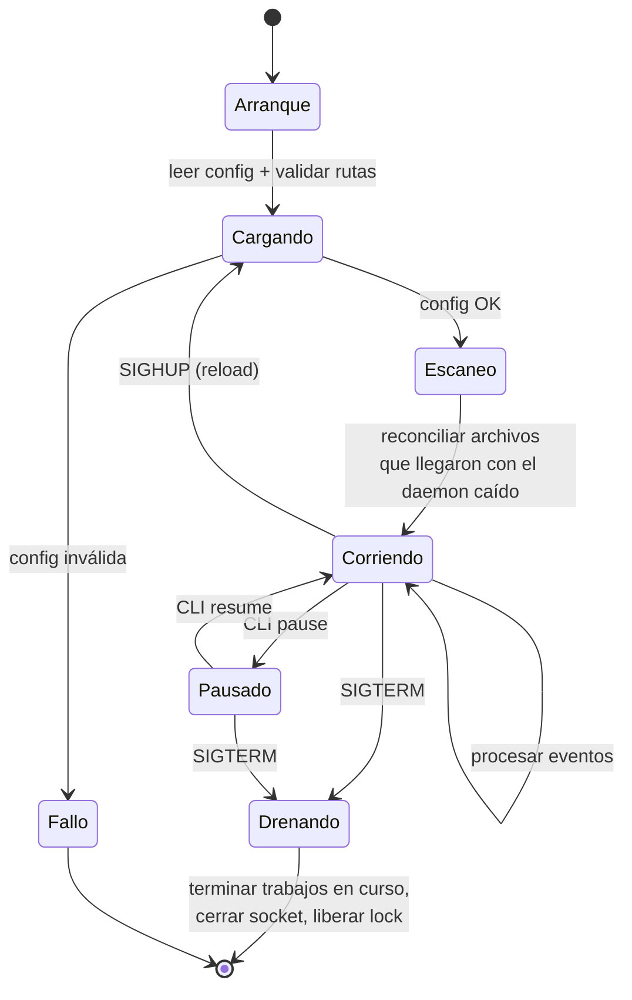

# 01 — Arquitectura

## 1. Vista general

Archivista es un **único proceso daemon** (`archivistad`) que corre en background, más dos
piezas externas con las que se comunica: el servidor de inferencia local (Ollama) y la
herramienta de línea de comandos (`archivista`) que el usuario usa para controlarlo.



---

## 2. Componentes

### 2.1 Watcher

**Responsable:** Agustín Gil · **Concepto de SO:** eventos del kernel (inotify), hilos

Registra *watches* de inotify sobre cada carpeta configurada y traduce los eventos crudos
del kernel a eventos de dominio.

Sólo nos interesan tres tipos de evento:

| Evento inotify | Significado | Acción |
|---|---|---|
| `IN_CLOSE_WRITE` | Alguien terminó de escribir y cerró el archivo | Encolar |
| `IN_MOVED_TO` | Un archivo apareció por `mv` o `rename()` | Encolar |
| `IN_CREATE` (dir) | Se creó un subdirectorio | Registrar watch nuevo si `recursive: true` |

Deliberadamente **ignoramos `IN_MODIFY`**: se dispara decenas de veces mientras un navegador
descarga un archivo, y siempre sobre contenido incompleto.

### 2.2 Debouncer

**Responsable:** Agustín Gil

Aun con `IN_CLOSE_WRITE` hay casos borde: descargas con archivos `.part`/`.crdownload`,
copias por red, archivos que se escriben en varias pasadas. Antes de encolar, el debouncer
verifica que el tamaño y el `mtime` del archivo no cambien durante una ventana configurable
(`stability_window`, por defecto 2 s), y descarta extensiones temporales.

### 2.3 Cola de trabajo y pool de workers

**Responsable:** Agustín Gil · **Concepto de SO:** hilos, sincronización, concurrencia

- Una `queue.Queue` acotada actúa como buffer productor/consumidor entre el watcher (1
  productor) y los workers (N consumidores).
- El tamaño del pool es configurable (`workers`, por defecto 4). El límite real no es la CPU
  sino **la inferencia del modelo**, que se serializa en Ollama.
- Un **conjunto de rutas en vuelo** protegido por `threading.Lock` impide que dos workers
  procesen el mismo archivo si llegan eventos duplicados.
- Cada archivo se toma con un **lock de archivo (`flock`)** durante la operación, para que
  dos instancias del daemon (o un reindexado programado corriendo en paralelo al watcher) no
  se pisen.

### 2.4 Extractor de contenido

**Responsable:** Emma Tamborini · **Concepto de SO:** manejo del sistema de archivos

Obtiene un fragmento de texto representativo del archivo para alimentar al modelo, más
metadatos baratos (extensión, MIME real vía *magic bytes*, tamaño, fechas).

| Tipo | Estrategia |
|---|---|
| `.txt` `.md` `.csv` | Leer primeros N KB |
| `.pdf` | Extraer texto de las primeras páginas |
| `.docx` `.pptx` `.xlsx` | Leer el XML interno del OOXML |
| Imágenes | Sólo metadatos (EXIF); **sin OCR** en la primera versión |
| Binarios / desconocidos | Sólo metadatos |

Hay un tope duro de caracteres enviados al modelo: el contexto cuesta tiempo de inferencia,
y el título más los primeros párrafos ya alcanzan para clasificar.

### 2.5 Clasificador por reglas

**Responsable:** Zahira Dellosa

**Se ejecuta siempre primero.** Reglas determinísticas por extensión, MIME y patrones en el
nombre. Cumple dos funciones:

1. **Atajo:** un `.jpg` de 4 MB no necesita un LLM para saber que es una imagen. Resolver por
   reglas los casos obvios baja muchísimo la carga de inferencia.
2. **Fallback:** si el modelo falla, timeoutea o devuelve algo inválido, el archivo igual se
   clasifica. El sistema **nunca** deja un archivo sin destino ni se cuelga esperando la IA.

### 2.6 Cliente de IA

**Responsable:** Emma Tamborini · **Concepto de SO:** IPC (sockets), manejo de errores

Habla por HTTP con Ollama en `127.0.0.1:11434`. Sus responsabilidades:

- Construir el prompt con el contexto del perfil activo y el árbol de carpetas existente
- Forzar **salida JSON estructurada** y validarla contra un esquema
- **Timeout** configurable (por defecto 30 s)
- **Reintentos** con backoff exponencial ante errores transitorios
- **Circuit breaker**: tras K fallos consecutivos deja de intentar durante T segundos y
  degrada a reglas, para no acumular latencia archivo tras archivo
- **Caché** por hash SHA-256 del contenido: el mismo archivo nunca se infiere dos veces

Contrato de respuesta esperado del modelo:

```json
{
  "category": "Documentos/Facultad/Sistemas Operativos",
  "confidence": 0.87,
  "reason": "El documento contiene un enunciado de examen de la materia Sistemas Operativos",
  "suggested_name": "2025-parcial-sistemas-operativos.pdf",
  "tags": ["facultad", "examen", "sistemas-operativos"]
}
```

Si `confidence` está por debajo del umbral configurado, gana la decisión por reglas.

### 2.7 Motor de perfiles

**Responsable:** Zahira Dellosa

Decide **qué se hace** con la clasificación, según el perfil activo:

| | 🎓 Estudiante | 👨‍🏫 Profesor |
|---|---|---|
| Árbol destino | Por materia y tipo de material | Por asignatura, comisión y unidad |
| Acción extra | Genera `<archivo>.resumen.md` | Genera/actualiza `INDICE.md` de la carpeta |
| Renombrado | Sugerido por el modelo | Normalizado a `UNIDAD-TEMA-vN` |
| Umbral de confianza | 0.6 (más permisivo) | 0.75 (más conservador) |

El perfil se define en config y puede sobreescribirse por carpeta observada.

### 2.8 Operador de filesystem

**Responsable:** Agustín Gil (operaciones) · Luca Lombardo (permisos y sandbox)
**Concepto de SO:** filesystem, permisos, syscalls

Única parte del sistema autorizada a tocar el disco. Garantiza:

- **Sandbox de rutas:** toda ruta se resuelve con `realpath()` y se valida contra la
  whitelist. Nada de `../..`, nada de seguir symlinks fuera del árbol permitido.
- **Movimiento atómico:** `os.rename()` si origen y destino están en el mismo filesystem;
  copia a temporal + `fsync` + `rename` si cruzan filesystems.
- **Colisiones de nombre:** nunca se pisa un archivo existente. Si el destino existe se
  compara el hash: idéntico → se marca como duplicado; distinto → sufijo ` (2)`.
- **Preservación de permisos:** el modo, el propietario y el `mtime` originales se conservan
  (`shutil.copystat`, `os.chown` cuando el daemon tiene privilegios).
- **Sin borrados directos:** cualquier operación destructiva se deriva a la cola de
  aprobación.

### 2.9 Servidor IPC

**Responsable:** Ginés Casajoana · **Concepto de SO:** IPC, permisos de archivos

Un socket de dominio Unix en `/run/archivista/archivistad.sock`, con permisos `0660` y grupo
`archivista`: **el control de acceso al daemon es el propio permiso del inodo del socket**.
Protocolo de líneas JSON, un request/response por conexión.

| Comando | Qué hace |
|---|---|
| `status` | Estado, uptime, tamaño de cola, contadores, salud del modelo |
| `pending` | Lista operaciones esperando aprobación |
| `approve <id>` / `reject <id>` | Resuelve una operación pendiente |
| `undo <id>` | Revierte un movimiento reciente usando el log de auditoría |
| `reload` | Recarga la configuración sin reiniciar (también vía `SIGHUP`) |
| `scan <ruta>` | Fuerza un reindexado de una carpeta |
| `pause` / `resume` | Suspende el consumo de la cola |

### 2.10 Auditor

**Responsable:** Santiago Arriaga

Dos salidas separadas con propósitos distintos:

- **Log operativo** (`/var/log/archivista/archivistad.log`): texto legible, rotado por
  `logrotate`, para diagnosticar.
- **Log de auditoría** (`/var/log/archivista/audit.jsonl`): una línea JSON **append-only**
  por operación sobre el filesystem. Es lo que hace posible `undo`, y es lo que le mostramos
  al profesor para demostrar que el sistema hace lo que dice.

```json
{"ts":"2026-08-14T10:32:11Z","op":"move","src":"/home/demo/Downloads/tp.pdf",
 "dst":"/home/demo/Documentos/Facultad/SO/tp.pdf","decided_by":"ai",
 "confidence":0.91,"profile":"estudiante","worker":"w2","duration_ms":2140}
```

---

## 3. Ciclo de vida del daemon



Puntos importantes:

- **Escaneo inicial:** inotify sólo avisa de lo que pasa *mientras* el daemon corre. Al
  arrancar, se reconcilia el estado de las carpetas observadas para no perder archivos que
  llegaron con el servicio caído.
- **Apagado ordenado:** ante `SIGTERM` deja de aceptar trabajo nuevo pero **termina** el que
  está en curso, para no dejar archivos a medio mover.
- **Instancia única:** un lock file con `flock` en `/run/archivista/archivistad.pid` impide
  dos daemons compitiendo por las mismas carpetas.

---

## 4. Modelo de concurrencia

Usamos **hilos, no procesos**. La justificación:

- El trabajo es I/O-bound (disco + HTTP a Ollama), así que el GIL no es el cuello de botella.
- Los hilos comparten la caché de IA, el conjunto de rutas en vuelo y la config sin
  necesidad de memoria compartida ni serialización.
- La CPU pesada sucede en **otro proceso** (Ollama), que sí paraleliza a nivel nativo.

Puntos de sincronización y qué protege cada uno:

| Recurso | Mecanismo | Riesgo que evita |
|---|---|---|
| Cola de trabajo | `queue.Queue` (interno) | Corrupción productor/consumidor |
| Rutas en vuelo | `threading.Lock` + `set` | Dos workers moviendo el mismo archivo |
| Caché de IA | `threading.Lock` + `dict` | Inferencias duplicadas |
| Archivo destino | `flock` sobre lockfile | Otro proceso escribiendo en paralelo |
| Cola de aprobación | Escritura atómica (`tmp` + `rename`) | Cola corrupta ante corte abrupto |
| Instancia del daemon | `flock` sobre PID file | Dos daemons simultáneos |

---

## 5. Estructura del repositorio

```
.
├── src/archivista/
│   ├── cli.py              # CLI (Ginés)
│   ├── daemon.py           # Ciclo de vida, señales, PID lock (Ginés)
│   ├── ipc/                # Servidor y cliente de socket Unix (Ginés)
│   ├── watcher/            # inotify + debouncer (Agustín)
│   ├── pipeline/           # Cola, workers, orquestación (Agustín)
│   ├── fsops/              # Movimientos, permisos, sandbox (Agustín + Luca)
│   ├── classify/
│   │   ├── rules.py        # Clasificador determinístico (Zahira)
│   │   ├── extract.py      # Extracción de texto/metadatos (Emma)
│   │   └── ai.py           # Cliente de modelo local (Emma)
│   ├── profiles/           # Estudiante / Profesor (Zahira)
│   ├── config/             # Carga y validación de config (Zahira)
│   └── observability/      # Logging, auditoría, notificaciones (Santiago)
├── config/                 # Config de ejemplo
├── deploy/                 # Unidades systemd, logrotate, scripts de instalación (Luca)
├── scripts/                # Scripts bash: demo, bootstrap, backup (Luca + Santiago)
├── tests/                  # Unitarios + integración (todos)
└── docs/                   # Esta documentación
```
