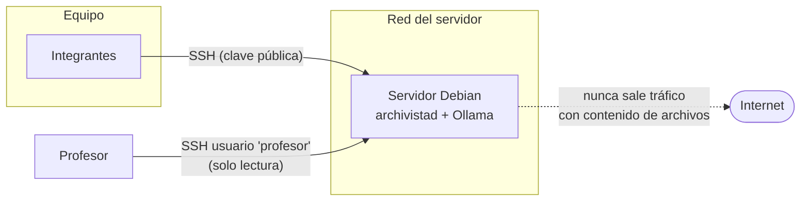

# 03 — Entorno y servidor

## 1. Hardware objetivo

| Recurso | Especificación |
|---|---|
| CPU | Intel Core i9 de laptop (≤ 3 años de antigüedad, ~8P+8E cores) |
| RAM | 32 GiB DDR4 |
| GPU | No se asume ninguna. **Toda la inferencia es CPU-only.** |
| Disco | SSD NVMe |
| SO | Debian 12 (bookworm) **minimal, sin entorno de escritorio** |

La decisión de fondo está en [ADR-0003](adr/0003-infraestructura-servidor.md).
**Responsable del servidor:** Luca Lombardo.

---

## 2. Por qué headless y por qué Debian minimal

1. **Menos superficie, menos ruido.** Sin entorno de escritorio no hay indexadores,
   *thumbnailers* ni sincronizadores tocando las mismas carpetas que estamos observando.
   Para un proyecto que reacciona a eventos del filesystem, eso importa: un `tracker-miner`
   corriendo de fondo genera eventos que no son del usuario.
2. **Se demuestra que es un servicio, no una app.** Si funciona sin GUI, es porque es de
   verdad un daemon.
3. **Es portable a una máquina con escritorio sin cambios.** El daemon no depende de nada
   gráfico. La única pieza opcional que aparece cuando hay escritorio son las notificaciones
   de `notify-send`, que están detrás de un flag de configuración y degradan a log si no hay
   sesión gráfica.

---

## 3. Modelo de IA y presupuesto de recursos

Corre en **Ollama**, como servicio local. La elección de Ollama está en
[ADR-0001](adr/0001-ia-local-con-ollama.md); la del modelo concreto y su presupuesto de tokens,
en [ADR-0007](adr/0007-modelo-local-y-presupuesto-de-inferencia.md).

### Modelos elegidos

| Nivel | Modelo | En disco | RAM en uso | Uso |
|---|---|---|---|---|
| 1 | `qwen3.5:2b` | ~2,7 GB | ~2,5 GiB | **Por defecto**: clasificación, ruta síncrona |
| 2 | `qwen3.5:4b` | ~3,4 GB | ~3,5 GiB | Resúmenes, índices y casos de baja confianza |
| opt-in | `qwen3.5:9b` | ~6 GB | ~6 GiB | Mejor redacción de resúmenes; 1–2 min por resumen en CPU |
| escape | `granite4.1:3b` | ~2,1 GB | ~2,5 GiB | Reemplazo del nivel 1 si Qwen falla en salida estructurada |
| degradado | `qwen3.5:0.8b` | ~1,1 GB | ~1,2 GiB | Sólo para el plan B de Oracle A1 |

### Presupuesto de inferencia

En CPU la latencia se reparte entre *prefill* (digerir la entrada) y *decode* (emitir la
salida), y el prefill de un texto largo cuesta más que cambiar de modelo. Por eso el techo se
fija en tokens, no en "modelo chico":

| Parámetro | Nivel 1 | Por qué |
|---|---|---|
| `think` | `false` | Clasificar es decidir, no razonar. Qwen3.5 razona por defecto: hay que apagarlo explícitamente |
| `format` | JSON Schema de `Classification` | Ollama acepta un esquema completo, no sólo `"json"` |
| `num_ctx` | 2048 | Techo, no aspiración |
| `num_predict` | 128 | Tope duro de la fase lenta |
| `max_content_chars` | 1500 (~450 tokens) | Nombre, ruta, MIME y primer párrafo son casi toda la señal |

> ⚠️ Las cifras de RAM y las latencias siguen siendo **estimaciones**. Medirlas en el hardware
> real es el [issue #3](https://github.com/Lucacux/files-clasifier-agentic-ai-usal/issues/3);
> el protocolo y los umbrales de aceptación están al final de
> [ADR-0007](adr/0007-modelo-local-y-presupuesto-de-inferencia.md). El resultado reemplaza esta
> sección.

### Estrategia de dos niveles

La clasificación es una tarea de decisión corta: el modelo chico alcanza y sobra. El modelo
grande sólo se invoca cuando el perfil pide **generación de contenido** (resúmenes), donde la
calidad sí se nota y la latencia no molesta porque es asíncrono, o cuando el nivel 1 devuelve
una confianza por debajo del umbral.

Presupuesto total en la laptop de 32 GiB: modelo cargado (≤ 3,5 GiB) + daemon (≤ 200 MiB) +
sistema base (~1 GiB) ≈ **menos de 5 GiB**. Sobra muchísimo margen.

### Contención de recursos

Para que el proyecto no vuelva inusable la máquina:

- La unidad de systemd de Ollama lleva `CPUQuota=` (por defecto 400%, o sea 4 cores) y
  `MemoryMax=`.
- `Nice=10` en el daemon: el trabajo de organización cede paso a lo que el usuario esté
  haciendo.
- `keep_alive` de Ollama configurado para descargar el modelo de RAM tras un período de
  inactividad.
- `OLLAMA_MAX_LOADED_MODELS=1`: los dos niveles no conviven en RAM. El nivel 2 desaloja al 1,
  que se recarga en la clasificación siguiente. Se cambia latencia por memoria acotada.

---

## 4. Plan B: cloud free tier

Nos preguntamos si el servidor podía ser una instancia gratuita en la nube. La respuesta
corta: **sólo una opción es viable, y no es la que la mayoría probaría primero.**

| Proveedor | Free tier | ¿Sirve? |
|---|---|---|
| AWS EC2 | `t2.micro` / `t3.micro`, 1 GiB RAM | ❌ No entra ni el modelo de 3B |
| Google Cloud | `e2-micro`, 1 GiB RAM | ❌ Igual |
| Azure | B1s, 1 GiB RAM | ❌ Igual |
| **Oracle Cloud** | **`VM.Standard.A1.Flex`: 4 OCPU ARM + 24 GiB RAM, siempre gratis** | ✅ **Única opción real** |

### Si vamos a Oracle Cloud

Ventajas: siempre disponible, IP pública fija, todo el equipo puede entrar por SSH sin
depender de que la laptop de alguien esté encendida, y el profesor accede desde cualquier
lado.

Costos a tener en cuenta:

- Es **ARM (aarch64)**, no x86. Ollama tiene builds ARM, pero hay que verificar los paquetes
  Python de extracción de PDF/OOXML.
- 4 OCPU ARM rinden bastante menos que un i9. Habría que quedarse sólo con el nivel 1
  (`qwen3.5:2b`, o `qwen3.5:0.8b` si no llega), apagar la generación de resúmenes por
  configuración y aceptar latencias mayores.
- La disponibilidad del free tier de Oracle es notoriamente intermitente al crear la
  instancia.

### Decisión

**Servidor principal: la laptop.** Nos da margen de recursos para mostrar el sistema
completo, incluyendo generación de resúmenes con el modelo grande.

**Plan B activo:** validar Oracle Cloud A1 en paralelo durante M0. Si funciona, queda como
entorno secundario permanentemente encendido para que la cátedra pueda entrar en cualquier
momento, incluso con la laptop apagada.

---

## 5. Topología de red y acceso



Reglas fijas:

- **SSH sólo con clave pública.** `PasswordAuthentication no`, `PermitRootLogin no`.
- `ufw` con política por defecto *deny*; sólo el puerto de SSH abierto.
- **Ollama escucha únicamente en `127.0.0.1`.** No se expone a la red bajo ninguna
  circunstancia.
- Ningún contenido de archivos sale de la máquina. Es consecuencia directa de usar un modelo
  local, y es uno de los argumentos fuertes del proyecto.

---

## 6. Usuarios y grupos del sistema

| Usuario | Tipo | Shell | Para qué |
|---|---|---|---|
| `archivista` | Servicio | `/usr/sbin/nologin` | Corre el daemon. Sin login. |
| `demo` | Normal | `/bin/bash` | Usuario "real" simulado cuyas carpetas se organizan en la demo |
| `profesor` | Normal | `/bin/bash` | Cuenta de la cátedra: lectura de logs, config y demo |
| *(cada integrante)* | Normal, sudo | `/bin/bash` | Desarrollo y operación |

| Grupo | Miembros | Da acceso a |
|---|---|---|
| `archivista` | `archivista`, integrantes | Socket de control, es decir, poder usar el CLI |
| `archivista-ro` | `profesor` | Lectura de logs, auditoría y config (vía ACL) |

El detalle de lo que puede y no puede hacer el profesor está en
[`05-acceso-profesor.md`](05-acceso-profesor.md).

---

## 7. Instalación

> El procedimiento operativo completo —incluidos los pasos manuales que ningún script puede
> hacer— está en [`10-runbook-servidor.md`](10-runbook-servidor.md). Esta sección se completa
> con los comandos reales verificados en el servidor.

Esquema previsto:

```bash
# 1. Bootstrap del sistema base (paquetes, cuentas, sysctl, hardening SSH, ufw).
#    Sin --apply no modifica nada: leé la salida primero.
sudo ./scripts/bootstrap-server.sh
sudo ./scripts/bootstrap-server.sh --apply

# 2. Ollama + descarga del modelo
sudo ./scripts/install-ollama.sh

# 3. Instalación del servicio
sudo ./deploy/install.sh

# 4. Configuración
sudo cp config/archivista.example.yaml /etc/archivista/archivista.yaml
sudo $EDITOR /etc/archivista/archivista.yaml

# 5. Arranque
sudo systemctl enable --now archivistad.service
sudo systemctl enable --now archivista-scan.timer

# 6. Verificación
archivista status
journalctl -u archivistad -f
```

### Parámetros de kernel que ajusta el bootstrap

```ini
# /etc/sysctl.d/60-archivista.conf
fs.inotify.max_user_watches   = 524288   # por defecto 8192: insuficiente para árboles grandes
fs.inotify.max_user_instances = 512
fs.inotify.max_queued_events  = 32768    # reduce IN_Q_OVERFLOW en ráfagas de eventos
```

---

## 8. Operación diaria

```bash
# Estado del servicio
systemctl status archivistad
archivista status

# Arrancar / detener manualmente (requisito explícito de la consigna)
sudo systemctl start archivistad
sudo systemctl stop archivistad

# Recargar configuración sin reiniciar
sudo systemctl reload archivistad     # envía SIGHUP

# Logs
journalctl -u archivistad -f                        # operativo, en vivo
tail -f /var/log/archivista/audit.jsonl | jq .      # auditoría de operaciones

# Operaciones esperando aprobación
archivista pending
archivista approve 7
```
