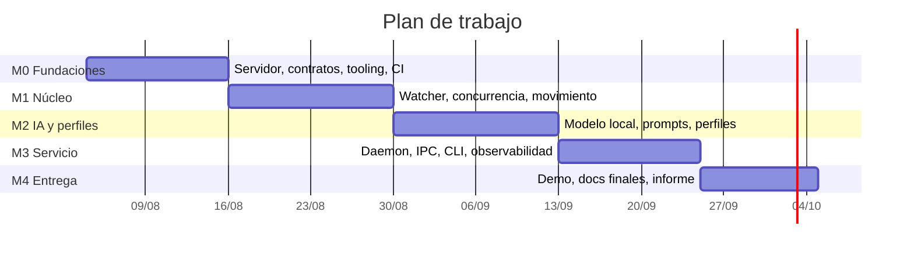
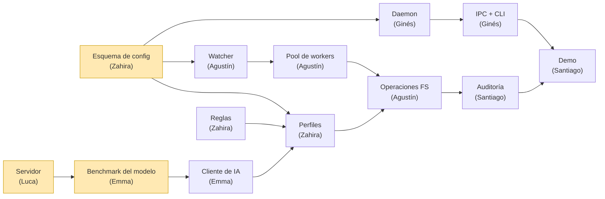

# 07 — Roadmap y planificación

## Estrategia

Cinco milestones. Cada uno termina en algo **demostrable**, no en "código escrito". La regla
es que al cerrar cada milestone el sistema tiene que poder mostrarse funcionando, aunque sea
en una versión reducida.

> Las fechas son orientativas y se ajustan contra el calendario real de la cursada. Lo que no
> se mueve es **el orden y las dependencias**.

---

## M0 — Fundaciones

**Objetivo:** que nadie quede bloqueado esperando a otro. Al cerrar M0, las seis áreas pueden
avanzar en paralelo contra interfaces estables.

| Entregable | Responsable |
|---|---|
| Servidor Debian 12 minimal provisionado y accesible por SSH | Luca |
| Usuarios, grupos y ACLs (`archivista`, `demo`, `profesor`) | Luca |
| Evaluación de Oracle Cloud A1 como plan B | Luca |
| Modelo local instalado y **benchmark de latencia real** documentado | Emma |
| Esquema de configuración definido y cargador implementado | Zahira |
| Paquete Python, tooling (ruff, mypy, pytest, pre-commit), `Makefile` | Santiago |
| CI en GitHub Actions | Santiago |

**Criterio de cierre:** un integrante nuevo clona el repo, corre `make check` y le pasa; y
hay un número medido de segundos que tarda el modelo en clasificar un archivo real.

---

## M1 — Núcleo de gestión de archivos

**Objetivo:** el sistema ordena archivos de verdad, todavía sin IA.

| Entregable | Responsable |
|---|---|
| Watcher inotify sobre carpetas configuradas | Agustín |
| Debounce y detección de archivos estables | Agustín |
| Cola de trabajo + pool de workers concurrente | Agustín |
| Movimiento atómico, colisiones y cruce de filesystems | Agustín |
| Clasificador por reglas (extensión, MIME, patrones) | Zahira |
| Extractor de texto y metadatos | Emma |
| Preservación de permisos y propietario | Luca |
| Sandbox de rutas y protección contra traversal/symlinks | Luca |

**Criterio de cierre:** se copian 50 archivos de golpe a la carpeta observada y todos
terminan en su lugar, sin pérdidas, sin duplicados y sin errores de concurrencia.

Cubre los requisitos funcionales 1 y 2 de la consigna.

---

## M2 — Inteligencia artificial y perfiles

**Objetivo:** la clasificación pasa a ser por contenido, y el perfil cambia el comportamiento.

| Entregable | Responsable |
|---|---|
| Cliente del modelo con timeouts, reintentos y circuit breaker | Emma |
| Prompt de clasificación con salida JSON validada | Emma |
| Caché de inferencias por hash de contenido | Emma |
| Motor de perfiles con conmutación en caliente | Zahira |
| Perfil Estudiante: generación de resúmenes | Zahira |
| Perfil Profesor: organización de material de clase | Zahira |

**Criterio de cierre:** el mismo archivo, con perfil Estudiante y con perfil Profesor,
termina en dos lugares distintos con dos salidas distintas. Y si se apaga el modelo, el
sistema sigue funcionando por reglas.

Cubre los requisitos funcionales 3, 4 y 5.

---

## M3 — Servicio, control y observabilidad

**Objetivo:** deja de ser un script y pasa a ser un servicio operable.

| Entregable | Responsable |
|---|---|
| Daemon: ciclo de vida, señales, PID lock | Ginés |
| Servidor IPC sobre socket Unix | Ginés |
| CLI `archivista` completo | Ginés |
| Cola de aprobación de operaciones destructivas | Ginés |
| Unidad systemd + timer de reindexado | Luca |
| Logging estructurado, auditoría JSONL y rotación | Santiago |
| Notificaciones al usuario | Santiago |

**Criterio de cierre:** `systemctl start/stop/reload` funciona, `archivista status` responde,
la máquina se reinicia y el servicio vuelve solo.

Cubre los requisitos técnicos 2 y 3.

---

## M4 — Entrega

**Objetivo:** que la cátedra pueda evaluar el trabajo sin fricción.

| Entregable | Responsable |
|---|---|
| Script de demo reproducible | Santiago |
| Guía de instalación desde cero, verificada en máquina limpia | Luca |
| Tests de integración end-to-end | Agustín |
| Grabación de la demo | Emma |
| Informe final + mapeo de requisitos completo | Santiago + Luca |

**Criterio de cierre:** alguien ajeno al equipo, siguiendo sólo la documentación, deja el
sistema andando en una máquina limpia.

---

## Dependencias críticas

En amarillo, los tres **caminos críticos**: si el esquema de configuración, el servidor o el
benchmark del modelo se atrasan, se atrasa todo lo demás. Son los primeros issues de M0.

---

## Riesgos

| Riesgo | Impacto | Mitigación |
|---|---|---|
| El modelo local es demasiado lento en CPU | Alto | Benchmark **temprano** en M0; modelo de 3B por defecto; reglas resuelven el grueso de los casos sin IA |
| El servidor depende de una laptop encendida | Medio | Plan B en Oracle Cloud A1 evaluado en paralelo durante M0 |
| El modelo devuelve JSON inválido o alucina categorías | Medio | Validación de esquema, umbral de confianza, fallback a reglas |
| Condiciones de carrera difíciles de reproducir | Alto | Tests de integración con ráfagas de archivos desde M1; locks documentados en la arquitectura |
| Un bug borra archivos del usuario | Crítico | **Ninguna operación destructiva es automática** ([ADR-0005](adr/0005-borrado-con-aprobacion-humana.md)); todo movimiento es reversible vía log de auditoría |
| Integrantes con menos experiencia en Linux quedan trabados | Medio | Las áreas de más SO puro fueron a quienes tienen más experiencia; el resto trabaja sobre Python con interfaces claras |
| Todo el trabajo se acumula al final | Alto | Milestones con criterio de cierre demostrable; revisión semanal del tablero |
