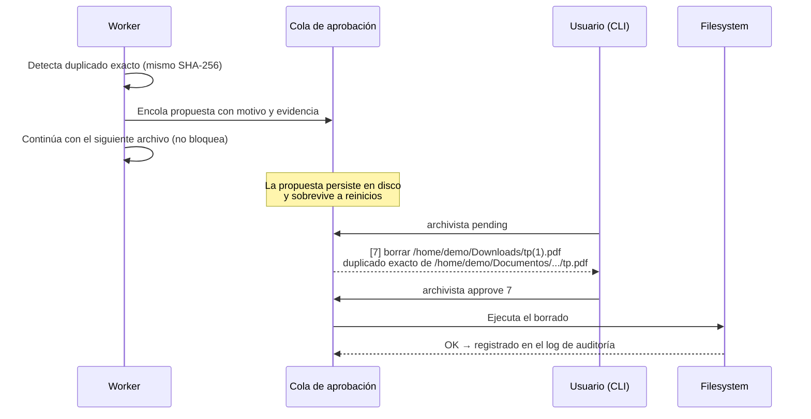

# ADR-0005 — Ninguna operación destructiva es automática

- **Estado:** Aceptada
- **Fecha:** 2026-07-29
- **Decide:** Luca Lombardo (PM)
- **Consultados:** todo el equipo

## Contexto

El sistema tiene acceso de escritura a las carpetas personales del usuario y toma decisiones
sobre ellas usando la salida de un modelo de lenguaje. Naturalmente aparece la idea de que
también limpie: borrar duplicados, borrar temporales, borrar instaladores ya usados.

Tres hechos que no se pueden ignorar:

1. **Un modelo de lenguaje se equivoca.** Un 3B cuantizado corriendo en CPU se equivoca más.
2. **Un bug en la resolución de rutas en un proceso que borra archivos no es un bug: es
   pérdida de datos.** Un `..` mal manejado, un symlink seguido sin querer, una ruta base mal
   normalizada.
3. **Borrar no tiene deshacer.** Mover sí. Es una asimetría fundamental entre las dos
   operaciones y tiene que reflejarse en el diseño.

Es un trabajo universitario que va a correr sobre carpetas reales de personas reales,
incluyendo la demo del profesor.

## Alternativas consideradas

### Opción A — Borrado automático según reglas y decisión de la IA

**Ventajas:** es la experiencia más "mágica"; el sistema realmente deja todo limpio solo.

**Desventajas:** un falso positivo destruye datos del usuario de forma irreversible. El riesgo
no está acotado por la calidad del modelo: basta un error en el código de rutas.

### Opción B — Papelera: mover a `~/.archivista/trash` en vez de borrar

**Ventajas:** reversible; el usuario no pierde nada de inmediato; sin fricción.

**Desventajas:** hay que gestionar la retención (si no se vacía, el disco se llena; si se
vacía sola, volvemos al borrado automático con un rodeo). Y sigue siendo el sistema decidiendo
solo qué sacar del medio.

### Opción C — Cola de aprobación: el sistema propone, el usuario dispone

**Ventajas:**

- Cero riesgo de pérdida de datos por decisión autónoma.
- El usuario ve **qué** se propone y **por qué** antes de que pase nada.
- Es un caso concreto de *human-in-the-loop*, que es exactamente la postura correcta para un
  sistema agéntico con permisos sobre el filesystem.
- Da algo bueno para demostrar: se le puede mostrar al profesor que el sistema pide permiso.

**Desventajas:** requiere que el usuario intervenga, lo que roza el requisito de la consigna
de funcionar "sin intervención constante". Y hay que construir la cola, la persistencia y los
comandos de CLI.

## Decisión

**Opción C: cola de aprobación.** Ninguna ruta de código del sistema borra archivos de forma
autónoma.

Sobre la tensión con "sin intervención constante del usuario": la consigna se refiere a la
**operación normal** del sistema, que es detectar, clasificar y organizar. Todo eso es
completamente automático. La aprobación aplica sólo a lo destructivo, que es una fracción
mínima de la actividad. La distinción es deliberada y la sostenemos:

> **Organizar es reversible y va solo. Destruir es irreversible y se pregunta.**

Flujo:

Cada propuesta guarda: ruta, operación, motivo legible, evidencia (hashes, tamaños, rutas
relacionadas), quién lo decidió (reglas o IA) y con qué confianza. Las propuestas expiran a
los N días si nadie las resuelve; expirar significa **descartar la propuesta**, nunca
ejecutarla.

### Regla de implementación

Esto no es una recomendación, es una regla de código verificable en revisión:

> **`os.remove`, `os.unlink`, `shutil.rmtree` y equivalentes sólo pueden aparecer dentro del
> módulo que ejecuta aprobaciones ya confirmadas.** En cualquier otro lugar del código, es un
> `blocking:` automático en la revisión del Pull Request.

## Consecuencias

### Positivas

- El sistema no puede destruir datos por su cuenta. Ni por un error del modelo ni por un bug
  de rutas.
- Postura defendible para un sistema con permisos sobre archivos ajenos.
- Excelente material de demo: muestra criterio de diseño, no sólo funcionalidad.
- El log de auditoría más los movimientos reversibles hacen que **toda** operación del sistema
  sea deshacible.

### Negativas / costos que aceptamos

- Los duplicados se acumulan hasta que alguien los aprueba.
- Hay que implementar cola persistente, expiración y comandos de CLI: es trabajo extra.
- Si nadie mira `archivista pending`, la cola crece sin sentido. Se mitiga con un aviso en
  `archivista status` y en el resumen periódico.

### Qué invalidaría esta decisión

Nada dentro del alcance de este proyecto. Si en el futuro se quisiera automatizar el borrado,
el camino sería la Opción B (papelera con retención) **como paso intermedio**, nunca el
borrado directo.
